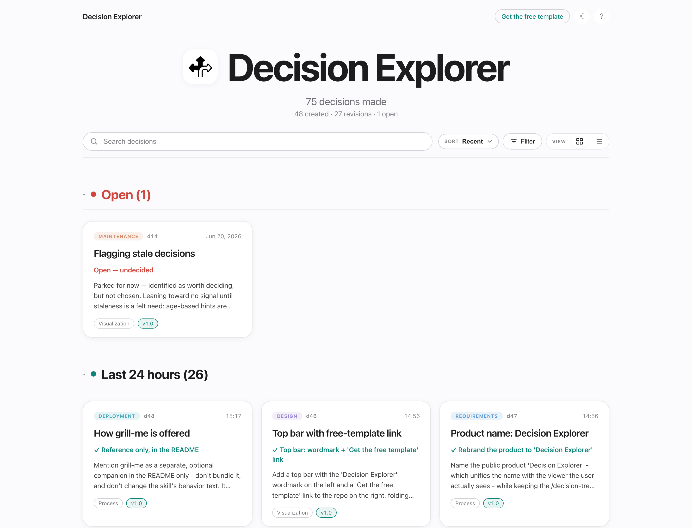

# Decision Explorer

<p align="center">
  <a href="https://github.com/JustKaylaThings">GitHub</a> ·
  <a href="https://www.linkedin.com/in/kaylamichjones/">LinkedIn</a> ·
  <a href="https://kayjo.co">Website</a>
</p>

A [Claude Code](https://claude.com/claude-code) skill that captures the **decisions** behind a
project — each with the options you weighed, their tradeoffs, what you chose and why — and renders
them as an interactive, offline **decision explorer** you open in any browser.

You log decisions in plain conversation ("`/decision-tree add ...`"); the skill writes one small
JSON file per decision and regenerates the viewer. The explorer lets you browse by recency, by SDLC
phase, by release version, search, and open any decision to see the chosen option, the full
options × tradeoffs comparison, and a timeline of how it changed over time.

No build step, no dependencies beyond **Python 3** — the viewer is plain HTML/CSS/JS and works fully
offline.

<p align="center">
  
</p>

## Quickstart (30 seconds)

1. **Install** — copy the skill into Claude Code (one-time, see [Install](#install-once) below).
2. **Log a decision** — in any project, run `/decision-tree add` and tell Claude what you decided;
   it drafts the options and tradeoffs, you confirm, it writes the file.
3. **See it** — run `/decision-tree view`, then serve the `decisions/` folder and open it in your
   browser (see [Open the viewer](#open-the-viewer)).

That's the whole loop: decide → confirm → explore. Everything below is detail.

## What's in this repo

```
skill/                     the installable skill
├── SKILL.md               how the skill behaves (Claude reads this)
├── generate.py            builds the viewer from the decision files
├── consulting.md          the "plan" flow (weigh a change against past decisions)
├── auditing.md            the "audit" flow (back-fill decisions from an existing codebase)
├── viewer/                the decision explorer (app.js, styles.css, index.html)
├── hooks/                 reconcile-decisions.py — optional Stop-hook backstop
└── settings.example.json  hook wiring to merge into a project's .claude/settings.json
decisions/                 this project's own decision log — a live example (open it in the viewer)
```

## Install (once)

Copy the skill into your personal Claude Code skills folder:

```sh
mkdir -p ~/.claude/skills/decision-tree
cp -R skill/SKILL.md skill/generate.py skill/consulting.md skill/auditing.md skill/viewer \
      ~/.claude/skills/decision-tree/
```

That's it — `/decision-tree` is now available in Claude Code. (Restart Claude Code if it was open.)

## Use it

In any project, just tell Claude what you decided:

- `/decision-tree add` — log a new decision (Claude drafts title, options, tradeoffs, the choice and
  why, then writes it once you confirm)
- `/decision-tree revise <id>` — record a change to a past decision (keeps the history)
- `/decision-tree plan` — weigh a new feature against existing decisions before you build
- `/decision-tree view` — (re)generate the viewer and get the path to open
- `/decision-tree list` — a compact text summary

The skill creates a `decisions/` folder in your project (one `NNNN-slug.json` per decision, plus
`_project.json`) and keeps the viewer in sync.

> **Pairs well with `grill-me`** — a separate, optional Claude Code skill that interviews you
> relentlessly about a plan until every branch of the decision is resolved. If you have it installed,
> run `/grill-me` to pressure-test a choice *before* you log it, so what lands in the tree is the
> version you've already stress-tested. Decision Explorer works fine on its own.

## Make it yours

The viewer reads a small `decisions/_project.json` (the skill creates it for you). Edit it to
personalize your explorer:

- **Name it** — the title shown big at the top of the page:

  ```json
  { "project": "My App — Decisions" }
  ```

  Defaults to "Decisions" if you leave it out.

- **Add an app icon** — drop an image named `icon.png` or `icon.svg` into your `decisions/` folder and
  it appears next to the title (it also tries `favicon.png` / `favicon.svg` / `favicon.ico`). To use a
  different filename, point to it explicitly:

  ```json
  { "project": "My App — Decisions", "icon": "logo.png" }
  ```

- **Group by a second dimension** *(optional)* — if your decisions map onto something like a screen or
  module, add a `secondaryAxis` label and the viewer gains a "By &lt;label&gt;" grouping mode plus
  filter chips:

  ```json
  { "project": "My App — Decisions", "secondaryAxis": "Screen" }
  ```

  Then decisions can carry an `area` value (Claude sets this when you mention which screen/module a
  decision belongs to).

## Open the viewer

The viewer reads the decision files live over `http://`, so serve the folder rather than
double-clicking the file:

```sh
cd your-project/decisions
python3 -m http.server
# then open http://localhost:8000/
```

(Opening `index.html` directly via `file://` won't work — browsers block local file reads.)

## Optional: the backstop hook

A `Stop` hook can nudge Claude at the end of each turn to check that every decision made in the
conversation got logged. To enable it in a project:

```sh
mkdir -p your-project/.claude/hooks
cp skill/hooks/reconcile-decisions.py your-project/.claude/hooks/
```

Then merge `skill/settings.example.json` into `your-project/.claude/settings.json` and open `/hooks`
(or restart Claude Code) so it takes effect. The hook uses `$CLAUDE_PROJECT_DIR`, so it's portable
across projects.

## Keeping this package up to date

The files in `skill/` are **copies** of the live skill at `~/.claude/skills/decision-tree/`. If you
improve the viewer or `SKILL.md`, re-copy them here before sharing:

```sh
cp ~/.claude/skills/decision-tree/SKILL.md      skill/SKILL.md
cp ~/.claude/skills/decision-tree/consulting.md skill/consulting.md
cp ~/.claude/skills/decision-tree/auditing.md   skill/auditing.md
cp ~/.claude/skills/decision-tree/generate.py   skill/generate.py
cp ~/.claude/skills/decision-tree/viewer/*      skill/viewer/
```

## Requirements

- [Claude Code](https://claude.com/claude-code)
- Python 3 (standard library only — no `pip install`)
